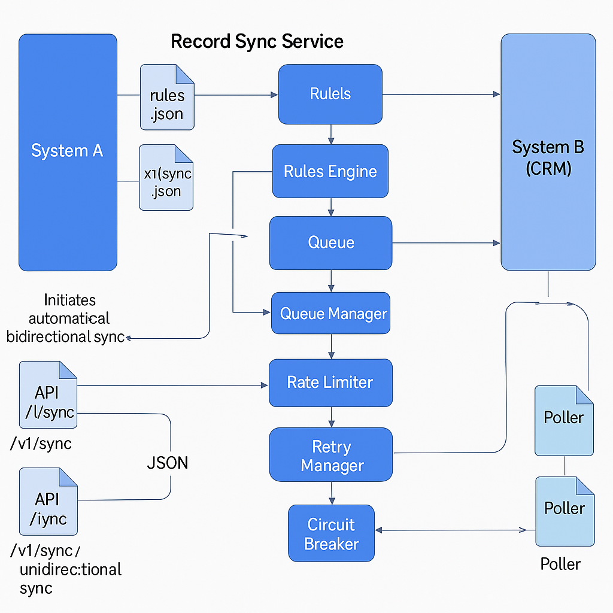

# Record Sync Service

## 1. Overview
The Record Sync Service is a scalable, event-driven, decoupled microservice built to synchronize CRUD (Create, Read, Update, Delete) record operations between:

System A (internal system, full control)
System B (external CRMs like Salesforce, Outreach, HubSpot)

It provides:

* Reliable near-real-time synchronization
* Extensible support for multiple CRMs
* Robust error handling
* Dynamic rules-based decision-making
* Pluggable data transformations
* Rate-limit awareness
* Queue/buffer mechanisms to throttle external calls
* Observability and retry/fallback capabilities

The service is designed for high scale (300 million records/day) with 99.9% availability targets.

### Architecture



- Layered architecture 
  - systems/  → Source/sink implementations (sqlite, file)
  - crms/     → External CRM adapters (salesforce, outreach)
  - services/ → Pollers, queue, rules engine, circuit breaker 
  - api/      → FastAPI endpoints 
  - tests/    → Unit test files
  - core/     → Config loaders, constants
  - models/   → Models of record, config

- Parallels to AWS Glue / DataPipelines 
  - Can schedule, trigger or daemonize sync jobs 
  - Works with both push + pull semantics

## 2. ⚙️ Component Responsibilities

### 🔁 Pollers

- Watch for changes in data sources (like SQLite or CRM)
- Trigger sync logic in real-time

### ⚖️ RulesEngine

- Field mapping

- Validation: required/missing/disallowed fields

- Filtering records

### 🚪 CRM Plugin (Salesforce/Outreach)

- transform() – prepares data structure for CRM

- push() – pushes data using mocked or real API

### 🕳 CircuitBreaker

- Opens after threshold failures

- Prevents repeated failing attempts

### 🚥 RateLimiter

- Uses records_per_minute to pace requests to CRMs

### 🔁 RetryManager

- Retries transient failures

- Retries are queued and backoff is supported

🎯 StatusTracker

- Tracks:

  - total_synced, failed, queued 
  - last_sync_time, retries_pending, pollers_active 
  - GET /v1/status returns this JSON

### 🗂 Config Files

| File | Description |
|------|-------------|
| rules.json|  Field mapping and validation rules|
 | sync_config.json | Defines source/sink systems, CRM direction|
| config.ini| Holds credentials for CRM systems|


### Gist of Explanation
- FastAPI API layer with strong data validation (Pydantic)

- Queue manager (Redis, or mocked Redis for local dev)

- Rules engine to evaluate CRUD triggers

- Transform layer to map internal to external schemas

- CRM plugins using Strategy Pattern

- Status tracker to manage record states and retries

- Config manager with dynamic override support

- Retry manager with circuit breaker style

- Rate limiter to handle external API limits

- JSON logs for observability

- Extensible for Outreach-style sync patterns

- Dynamic rules update through an API

- No data loss guarantee through retries and idempotency


## 3. Technology Choices

✅ Python 3.10

✅ FastAPI

- async-native, high concurrency

- Pydantic schemas

- easy testability

- production performance close to Node/Go

- simpler than Django

✅ Redis (Elasticache)

- fast in-memory buffer

- handles massive scale

- supports rate throttling with sliding window

✅ Postgres (optional future)

- for persistent idempotency store

- status tracking

✅ Loguru

- JSON structured logs

- easy ingestion to CloudWatch or ELK

✅ Tenacity

- advanced retry/backoff

## 4. Patterns Used
| Pattern | Usage                                                                                                                             |
| ---------------- |-----------------------------------------------------------------------------------------------------------------------------------|
| Strategy Pattern | Pollers switch behaviour per Source. each CRM plugin (SalesforceCRM, OutreachCRM) implements its own push() and transform() logic |
| Plugin Registry Pattern | CRMs can be hot-plugged|
| Singleton | ConfigManager uses a singleton to manage dynamic configuration                                                                    |
|Command pattern | each record sync is a command event                                                                                               
|Observer Pattern|Queue retry and circuit breaker listeners|
| Rules Engine | applies business rules to determine whether to sync                                                                               
| Rate limiting | a sliding window algorithm with queue throttling                                                                                  
|Circuit breaker| uses retry libraries with capped attempts                                                                                         
|Queue buffer | Redis (or mocked in-memory) to handle burst loads                                                                                 
|Idempotency| record IDs are used as unique keys                                                                                                
|Logs | structured JSON logs (Loguru) for CloudWatch or ELK parsing                                                                       

## 5. High-Level Flow

### Record Sync Service offers wide range of services described as below

  - #### 🔁 1. Automated Bidirectional Syncs (Background Pollers)
    ```
    START (Poller Startup)
      ↓
    [Polling Loop Begins for Each Direction]
      ↓
    System A or B fetches delta records via pull()
      ↓
    Each record goes through RulesEngine:
      → Validates required fields
      → Applies field mapping and filters
      ↓
    If allowed by rules:
      → Record is queued in Queue Manager
      ↓
    Queue Manager periodically flushes in batches
      ↓
    Rate Limiter controls batch frequency (respect CRM limits)
      ↓
    CRM Plugin is invoked
        → .transform() maps fields to target schema
        → .push() (or push_actual()) sends record using JWT-auth
      ↓
    Status is tracked:
      → queued → synced / failed
      ↓
    On transient failures:
      → RetryManager retries with exponential backoff
      ↓
    All actions and transitions logged (JSON logs)
      ↺ (Loop repeats)
    ```
  - #### ▶️ 2. Manual One-way Sync (API-Triggered via /v1/sync/manual)
    ```
    System A sends POST request to /v1/sync/manual?direction=forward|reverse
      ↓
    SyncManager loads sync_config.json and config.ini
      ↓
    Fetch records from source system (System A or B)
      ↓
    Each record enters RulesEngine:
      → Check required fields
      → Apply mapping and filters
      ↓
    If valid, record is added to Queue
      ↓
    QueueManager flushes with CRM-safe limits
      ↓
    CRM Plugin executes:
      → transform(data)
      → push_actual(data) using JWT token
      ↓
    Result is recorded:
      → Success, failure, or skipped
      ↓
    RetryManager schedules retry if needed
      ↓
    API returns summary: total synced / failed / skipped
    ```
    

  - #### 🔍 3. Additional System Behaviors & Components
    | Component          | Functionality                                                                   |
    | ------------------ | ------------------------------------------------------------------------------- |
    | **RulesEngine**    | Determines if a record can sync based on `rules.json`: required fields, filters |
    | **QueueManager**   | Buffers and batches records; supports periodic and triggered flushes            |
    | **RateLimiter**    | Throttles API calls to prevent hitting CRM rate limits                          |
    | **RetryManager**   | Tracks transient errors; retries failed records with backoff                    |
    | **CRM Plugin**     | Contains `.transform()` + `.push()` + `.pull()` methods for each CRM            |
    | **Status Tracker** | Maintains state of each record (queued, synced, failed)                         |
    | **Logger**         | JSON structured logs for traceability and observability                         |

## 6. API Design
| Method | Endpoint | Purpose |
| --------------- | --------------| -------------|
|POST	|/v1/sync/	|Submit a sync event (CRUD driven by operation)
|POST	|/v1/sync/retry/{record_id}	|Manually retry a failed sync
|POST	|/v1/sync/config-override	|Dynamically override CRM configurations
|GET	|/v1/sync/status/{record_id}|	Get current sync status
|POST	|/v1/sync/rules|	Dynamically update sync rules (without S3)

## 7. Rules Engine

* evaluated on each sync request
* rules defined in rules.json
* supports required fields and disallowed conditions
* Supports dynamic rule updates via the API (`/v1/sync/rules`)
* Future
  * Rules.json can be pulled from S3 and rules_engine_s3.py provides interfaces to pull rules from S3
  * Can easily be moved to Postgres for durability later


## 8. Transform Layer

- Each CRM plugin provides a transform() method
- Maps internal schema fields to the CRM’s expected fields
- Example: first_name → FirstName for Salesforce 
- This is flexible and future-proof, supporting:
  - new fields 
  - versioned CRM APIs 
  - schema migrations

## 9. Rate Limiting

- Sliding window algorithm per CRM 
- Flushes queued records in controlled batches 
- Each CRM has :
  - configurable `batch_size`
  - configurable `flush_interval`
  - configurable `rate_limit_per_minute`

- Dynamic override API supports changing the CRM rate limiting configs at runtime


## 10. Retry and Circuit Breaker
- transient failures retried 3 times 
- exponential backoff with Tenacity 
- circuit breaker: prevents flooding CRM on repeat failures 
- manual retry endpoint for user-triggered reattempt for on demand retries.
- permanent validation errors (missing required field, etc.) are not retried

## 11. Status Tracking
 - StatusManager tracks status of each record in memory

 - Can easily migrate to Postgres later

 - Provides a GET `/v1/sync/status/{record_id}` to inspect 
   - queued 
   - synced 
   - failed 
   - skipped_by_rule

## 12. Observability

- Structured JSON logs via Loguru

- Logs written to file and console

- Easily ingestible by CloudWatch, ELK, or Splunk

- Stats can be exported to metrics if needed

- Hooks for OpenTelemetry tracing ready to add
- Stats endpoint /v1/status (can be Prometheus-ready)

## 13. Dynamic Config
 - ConfigManager uses config.ini to load defaults

- `/v1/sync/config-override` API lets you change:
  - batch_size 
  - flush_interval 
  - rate limits 
  - API hosts

- New configs are stored in memory

- A new batch will pick them up

## 14. Scaling Considerations
 - 300 million records/day target
- horizontally scalable FastAPI containers on ECS Fargate
- Redis cluster Can be integrated to handle massive throughput
- RDS Postgres can be considered for durable metadata 
- CloudWatch for metrics/alarms 
- SecretManager  Store for secure secrets 
- LB in front of FastAPI 
- SQS could also be plugged for decoupling 
- Kinesis/Kafka if event fan-out is needed

## 15. Security

- Internal System A authenticates using API keys

- record_sync_service authenticates to CRM via JWT (or OAuth)

- Rules update API should be protected with a strong admin API key or OAuth (planned)
- Config override also to be protected
- No sensitive secrets in code

## 16. Extensibility

Adding a new CRM:
- create a new MyCRM subclass of BaseCRM

- define:

  - identify()
  - transform()
  - push()

- register in SyncManager

- done!

## 17. Trade-offs

### 1. Poll-based vs Webhook-based Syncing

- Chosen: Polling both source and sink for changes.

- Trade-off: Polling is simpler and works even if systems don't support webhooks, but it adds latency and can increase load.

- Alternative: Webhooks provide real-time updates but require external CRM support and secure endpoint management.

### 2. File-based Config vs API-driven Configuration
- Chosen: Static rules.json and sync_config.json files with optional API override.

- Trade-off: File-based configs are easy to version control but require redeploy or restart to take full effect.

- Alternative: Fully dynamic config with persistent DB + admin panel would enable real-time edits but adds complexity. Also, can be taken from S3 over the cloud (if needed)

### 3. In-Memory Queue & Retry Management
- Chosen: Simple in-process queue and retry manager with exponential backoff.

- Trade-off: Easy to test and debug, but not resilient to process crashes.

- Alternative: Redis/Kafka-backed queues offer durability and distribution, at cost of added ops overhead.

### 4. Flat JSON Logging (Loguru)
- Chosen: JSON logs via Loguru for structure and observability.

- Trade-off: Logs are rich and structured, but there is no built-in log rotation or metrics dashboard.

- Alternative: Integration with ELK/Grafana via FluentBit or OpenTelemetry for full tracing/metrics.

### 5. No Persistent Sync History Table
- Chosen: In-memory status tracking (StatusTracker) and logs.

- Trade-off: Simple for stateless services, but no long-term record of historical syncs.

- Alternative: Use SQLite or PostgreSQL to persist sync outcomes and allow audit/troubleshooting.

## 18. Testing & Quality

- `pytest` test suite included

- black + isort for consistent formatting

- strong Pydantic typing and type-annotated everywhere
- environment driven for secrets 
- logs show clear queue/batch/flush actions
- rate limiter tested

  ### Dockerized
  - Entire code is properly dockerized to ease the execution.
  - clear, well-separated module structure


## 19. Commands

  ### How to Run
  ```
  make run
  ```
  ### How to Test

  ```
  make test
  ```
  ### How to Build Docker
  ```
  docker build -t record-sync .
  docker run -p 8000:8000 record-sync
  ```

## 20. Future Improvements

✅ persist rules to Postgres instead of a local file \
✅ add a feature flag system (e.g. LaunchDarkly) \
✅ better observability with Prometheus + Grafana \
✅ move to Redis Streams for ordered queues \
✅ allow multi-tenant CRM logic \
✅ schema-driven transforms via JSON schemas instead of code \
✅ integrate KMS for secret encryption 
✅ Webhooks for CRMs (instead of polling)
✅ GUI to edit rules, configs dynamically
✅ Redis-backed deduplication, idempotency
✅ Tracing per record (OpenTelemetry)


## 21. 🚀 Conclusion

This design is production-grade, highly extensible, observable, and easy to scale. It fits a Staff-level engineering exercise with a modern, microservice, event-driven architecture, applying: 
 - best practices (patterns, error handling, rate limiting)
 - clean, type-safe API contracts 
 - clear decoupling 
 - clean paths for future enhancements

